This document presents a central resolution mechanic for tabletop RPGs. It is
_not_ a complete game in itself. In fact, it conforms to the [Mosaic Strict]
design principle: it does not rely on any mechanic or quantified state of any
other game text, and it assumes no other rules are in use other than free
role play. Its compatibility with any other set of mechanics is _not_
guaranteed.

The human-readble text below is licensed under the Creative Commons Attribution
4.0 International License. To view a copy of this license, visit
<http://creativecommons.org/licenses/by/4.0/>.

[][cc]

## What Do I Do?

When you want to try something where the outcome is both _interesting_ and
_uncertain_, ask the table, "What are the chances my character can do this?"
Together, settle on one of the following:

- _Poor_: You'll probably fail. If you still try, **check 2**.
- _Even_: You could fail. You could succeed. If you try, **check 3**.
- _Fair_: You're more likely to succeed than to fail. If you try, **check 4**.
- _Great_: You're very likely to succeed. If you try, **check 5**.

## What Does "Check" Mean?

You need a way to determine binary pass/fail states in sequence. This can be
flipping coins, rolling a die and looking for evens or odds, etc. Whenever
you check, decide which result counts as a **pass**. (For example, I would
default to heads/evens being passes.)

"Check N" means you're going to use (up to) N of these. Always start by
checking 2. If they're both passes, you succeed! If not, check 1 at a time until
you get 2 passes or you've checked a total of N, whichever comes first. If you
check all N and haven't gotten 2 passes, you don't succeed.

### What Are the Actual Odds?

For "Check N," look up N on the following table. The percent chance has been
rounded slightly, to be nice.

|  2  |  3  |  4  |  5  |
| :-: | :-: | :-: | :-: |
| 25% | 50% | 69% | 81% |

## What Are Degrees of Success?

Whenever you check, stop after getting 2 passes. If you had to check all N
times, you earn a **weak success**: you achieved your started goal, but there
was some cost, consequence, etc. If you got 2 passes before you checked all N,
you earn a **strong success**: you succeed fully, earning your goal without much
lasting trouble.

If you check all N and haven't gotten 2 passes, you earn a **miss**. Depending
on the action, there may be additional consequences for failure.

## How Can I Use This?

You can substitute these rules for the resolution procedure for another RPG.
The only requirement is that you and your group have a relatively clear
understanding of your character's abilities, strengths, weaknesses, and other
qualities, as well as of the genre and setting you are playing in.

This mechanic can also serve well for solo play, as long as you are honest with
yourself about your character's chances. You can even use it as an **oracle** to
determine outcomes of external events (in the absence of a player referee). Just
decide how likely the outcome is, then check as described above.

---

<!-- Links & References -->

[Mosaic Strict]: http://blog.trilemma.com/2021/02/nothing-at-bottom-mosaic-strict-rpg.html
[cc]: http://creativecommons.org/licenses/by/4.0/
